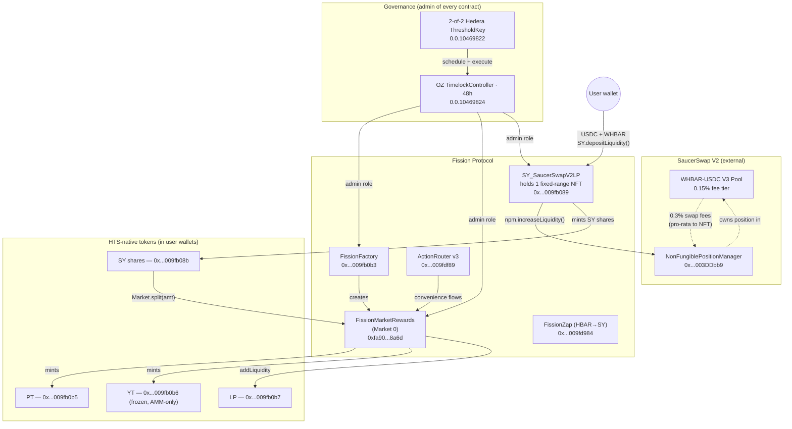
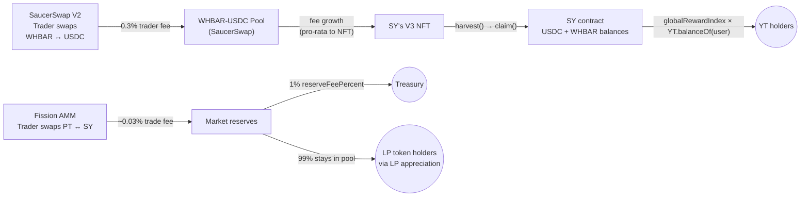
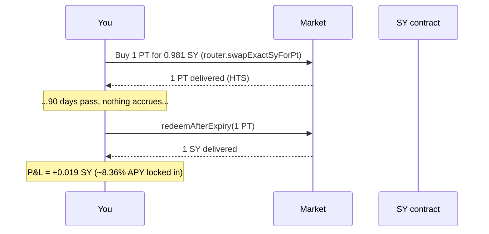
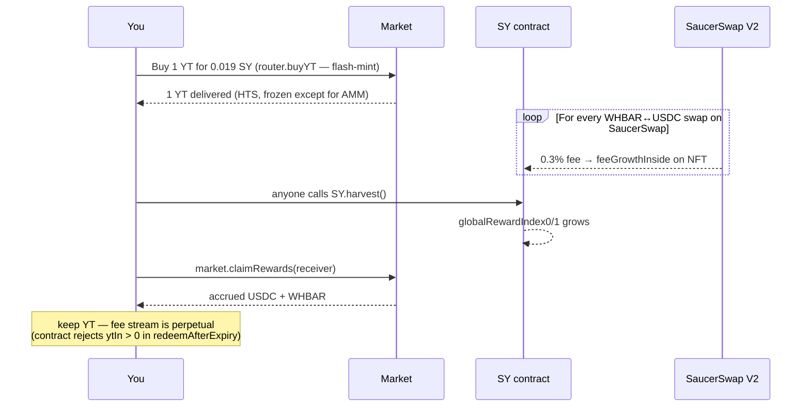
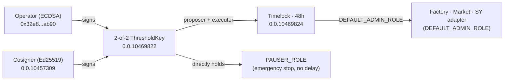

# Fission Protocol — Hedera

**Yield tokenization on Hedera mainnet.** Take a yield-bearing SaucerSwap V2 LP position, split it into a fixed-rate **Principal Token (PT)** and a variable-yield **Yield Token (YT)**, and let users trade either half on a Pendle V2-faithful AMM.

> **Live** on Hedera mainnet (chain 295) · HTS-native PT / YT / LP tokens · Pendle V2 logit-curve AMM · Pendle-Kyber pattern adapter for V3 NFTs · governed by a 2-of-2 Hedera ThresholdKey behind a 48-hour OZ Timelock.

App: <https://www.fissionp.com> · Source: this repo.

---

## TL;DR — what the protocol does in one paragraph

The protocol owns one SaucerSwap V2 LP NFT (currently a full-range WHBAR–USDC position). Users deposit USDC + WHBAR → the SY adapter adds that liquidity to its NFT and mints **SY shares**. 1 SY can then be **split** into 1 PT + 1 YT, both HTS-native fungibles visible in HashPack. PT redeems 1:1 for SY at maturity (fixed-rate); YT continuously accrues the V3 swap fees the SY's NFT earns (variable-rate, **perpetual** — YT never expires in our design). PT and SY trade on a Pendle V2 logit-curve AMM; LPs in that AMM earn 99% of the AMM swap fees.

---

## How the whole thing fits together



The picture: external V3 pool generates fees → our SY's NFT collects them → SY distributes them as reward tokens → Market routes them to YT holders.

---

## Where the yield actually comes from

Two completely independent fee streams. Don't confuse them.



| Stream | Source | Rate | Splits to |
|---|---|---|---|
| **A: Fission AMM fees** | PT ↔ SY trades on our market | ~0.03% per trade | **99%** to LPs (via pool growth), **1%** to treasury |
| **B: SaucerSwap V2 fees** | WHBAR ↔ USDC trades on SaucerSwap | 0.3% per trade | **100%** to YT holders, proportional to YT balance |

PT receives nothing on-chain during the term — its yield is the **buy-time discount** that becomes the redemption surplus at maturity (see math below).

---

## The three roles, with worked numbers

Imagine the implied APY on Market 0 is **8.36%** (which is what `lastLnImpliedRate = 80,312,240,204,727,220` decodes to today). Over the remaining ~83 days, that's a **~1.9% discount on PT**.

### PT — fixed yield



**Cost basis:** 0.981 SY today. **Payoff:** 1 SY at expiry. **Profit:** 0.019 SY (the discount). Fixed, unconditional, paid by YT-side buyers.

### YT — variable yield (perpetual)



**Cost basis:** 0.019 SY. **Payoff:** stream of USDC + WHBAR forever — could be more or less than 0.019 SY over any term. YT does NOT go to zero at expiry (Pendle-Kyber pattern: exchangeRate ≡ 1e18 → there's no expiry mechanic on SY).

### LP — AMM market-making

Provide proportional SY + PT to the AMM, earn 99% of swap fees (the other 1% goes to treasury). Post-expiry, `removeLiquidity` auto-redeems the LP's PT share for SY (audit fix H-4) so LPs always recover full SY value plus accumulated fees.

---

## Call paths the dApp drives

Each strategy page bundles its underlying contract calls behind a single user interaction. Here's the literal call graph for every flow:

### HBAR-source (the default on `/pt`, `/yt`, `/lp`)

When a user types `$5` on the Buy PT page, the dApp chains 2-4 wallet popups (Phase 7 design): HTS associate → zap HBAR→SY → approve SY → swap SY→PT. The frontend submits these sequentially, polling the chain between steps so the *actual* SY received feeds the next call (Hashio is briefly stale post-receipt; we retry up to 5×).

```
User HBAR
  │
  ├─[1] HTS associate SY share + PT (optional, only when max_auto_assoc=0)
  ├─[2] FissionZap.zapHbarToSy{value: 15 HBAR}(sy, ..., receiver=user)
  │       └─ wraps half→WHBAR, swaps half→USDC, deposits to V3 LP, mints SY
  ├─[3] SY-share.approve(router, syReceived)            (skip if already)
  └─[4] ActionRouter v3.swapExactSyForPt(market, syIn, minPtOut, user, deadline)
          └─ AMM mints PT to user
```

#### What about the atomic MegaZap?

A `FissionMegaZap` contract is deployed at `0x...009fdf8c` (`0.0.10477452`) and was wired into the dApp briefly, but on-chain QA (`scripts/qa-wave-a.mjs`) caught two blockers:

- **`zapHbarToYt` hits `MAX_CHILD_RECORDS_EXCEEDED`** — Hedera's 50-records-per-consensus-tx cap. The internal chain `zapHbarToSy → splitTo → swapExactPtForSy` produces too many HTS child records. No fix on contract logic alone; needs a split-into-multiple-txs design (which is what the Phase 7 chain already does).
- **`zapHbarToPt` and `zapHbarToLp` revert `InsufficientOutput()`** at both small (6 HBAR) and larger (50 HBAR) inputs with identical gas (~7.85M), suggesting the post-zap `syReceived` is being read as 0 by the MegaZap. Likely a contract-side bug in how FissionZap delivers shares to a non-EOA receiver — under investigation.

The MegaZap is therefore **disabled in production** (env var unset). A v2 design will either fix the receiver-handling in FissionZap (so MegaZap can chain at the contract level) or formalise the multi-tx flow with a dedicated session-key pattern.

### SY-source (existing-SY-holders)

Skip step 2. User starts with SY already in their wallet (from a previous zap or external mint).

### Add liquidity (router v3)

After ActionRouter v3 (2026-05-14) the dApp routes Add LP through the router — the v2 typing bug that forced a market-direct workaround is fixed. Approvals are on the SY-share + PT toward the router.

```
User holds SY share + PT
  │
  ├─[1] HTS associate LP token (optional)
  │
  ├─[2] SY-share.approve(router, syIn)
  ├─[3] PT.approve(router, ptIn)
  │
  └─[4] router.addLiquidityProportional(market, syIn, ptIn, minLpOut, user, deadline)
          └─ router pulls SY + PT from user → market.addLiquidity → LP to user
```

### Remove liquidity (router v3)

```
User holds LP
  │
  ├─[1] LP.approve(router, lpIn)
  │
  └─[2] router.removeLiquidityProportional(market, lpIn, minSyOut, minPtOut, user, deadline)
          └─ router pulls LP from user → market.removeLiquidity → SY + PT back to user
```

### Other paths

| Action | Contract | Function |
|---|---|---|
| Split SY → PT + YT | `Market` | `split(amount)` (1:1 mint, no AMM) |
| Merge PT + YT → SY | `Market` | `merge(amount)` (1:1 burn) |
| Claim YT yield | `Market` | `claimRewards(receiver)` (per-token reward indices) |
| Redeem at expiry | `Market` | `redeemAfterExpiry(ptIn, ytIn=0, receiver)` (PT only — YT is perpetual) |

### Trade-size + slippage guardrails (UI-side)

- Max input per trade = **1% of pool depth** (`totalSy + totalPt`). Prevents low-TVL AMM slippage from blowing past the user's tolerance.
- Slippage tolerance UI is chip-based: 0.10% / 0.50% / 1.0% / custom. Capped at 1.00%.

---

## The math — Pendle V2 logit curve

The AMM math is a faithful port of Pendle V2's `MarketMathCore`. Key invariants and formulas:

**Pool state** (per market):
```
totalSy        : SY shares held in the AMM
totalPt        : PT held in the AMM
lastLnImpliedRate  : persisted across trades (ln(1+r) at 1e18 fixed-point)
scalarRoot         : concentration parameter (currently 75e18 — heavy concentration)
lnFeeRateRoot      : trade fee (currently 3e14 → ~0.03% time-equivalent)
```

**Implied APY decoded from `lastLnImpliedRate`** (this is what the UI shows):

```
x = lastLnImpliedRate / 1e18
implied APY = (e^x − 1) × 100  %
```

For the current Market 0 value `80,312,240,204,727,220`:
```
x = 0.08031
implied APY = (e^0.08031 − 1) × 100 = 8.36 %
```

**Curve concentration** — at proportion p of PT in the pool, the scalar is amplified by time:

```
scalar(t) = scalarRoot × IMPLIED_RATE_TIME / timeToExpiry
rateAnchor = exchangeRate − ln(p / (1−p)) / scalar(t)
```

As `timeToExpiry → 0`, `scalar → ∞`, the curve flattens, and PT price pulls to par (1 SY). That's the "pull-to-par" that makes the fixed-yield delivery possible.

### Slippage vs trade size (Market 0, today's reserves)

With current reserves (~$96/side, scalarRoot=75) and 83 days to expiry:

```
Trade size →  Approx price impact on PT
  $10  →  ~0.05%
  $50  →  ~0.25%
  $100 →  ~0.6%
  $500 →  ~3.5%   ← uncomfortable
  $1k  →  ~7%     ← thin
```

To stay below 1% slippage on $500 trades you'd want ~$5k/side. As LP TVL grows, slippage falls linearly with reserve size.

### PT price pull-to-par over the term

```
PT price (in SY)
  1.00  ─────────────────────────────●  expiry
        |                           ╱
  0.985 |                       ╱
        |                   ╱
  0.97  |               ╱
        |           ╱
  0.95  |       ╱
        |   ╱
  0.93  ●           ←  today (t = 0)
        └──────────────────────────────→ time
        0d                            90d
```

Mechanically: at t=0 PT is at a discount that annualizes to the implied APY; as t→expiry the discount shrinks proportionally to remaining time; at t=expiry PT redeems 1:1 with SY.

---

## SaucerSwap contracts we integrate with

All on Hedera mainnet. These are external to our deploy — we read/call them.

| Component | EVM address | Hedera ID | What we use it for |
|---|---|---|---|
| **NonFungiblePositionManager (V3)** | `0x00000000000000000000000000000000003DDbb9` | `0.0.4053945` | The SY adapter owns ONE NFT minted here; we call `increaseLiquidity()` on every deposit and `collect()` to harvest fees |
| **SwapRouter02 (V3)** | `0x00000000000000000000000000000000003c437a` | `0.0.3949434` | Operator scripts swap WHBAR → USDC via `exactInputSingle(...)` selector `0x414bf389` when seeding/topping-up the SY |
| **WHBAR contract** | `0x0000000000000000000000000000000000163b59` | `0.0.1456985` | `deposit()` to wrap HBAR → WHBAR before deposit |
| **WHBAR (HTS token)** | `0x0000000000000000000000000000000000163b5a` | `0.0.1456986` | ERC-20 facade for approvals/transfers |
| **USDC (HTS token)** | `0x000000000000000000000000000000000006f89a` | `0.0.456858` | Same |

**Pool:** WHBAR-USDC, 0.15% fee tier (POOL_FEE=1500 in Uniswap V3 fee convention). The SY's NFT is a full-range position by default; range was chosen at SY deploy time and is immutable.

---

## Our contracts (Hedera mainnet, chain 295)

All deployments tracked in [`deployments/295.json`](deployments/295.json).

| Contract | EVM address | Hedera ID | Role |
|---|---|---|---|
| `FissionFactory` | `0x00000000000000000000000000000000009fb0b3` | `0.0.10465459` | Whitelists SY adapters, deploys Market instances per maturity |
| `ActionRouter v3` | `0x00000000000000000000000000000000009fdf89` | `0.0.10477449` | Stateless user-facing router. **v3 fixes the SY-share typing bug from v2**: `addLiquidityProportional` now pulls `sy.shareToken()` correctly, so Add LP routes through the router again. `maxAutomaticTokenAssociations = -1`, operator-admin. |
| `~ActionRouter v2 (abandoned)~` | `~0x00000000000000000000000000000000009fd993~` | `~0.0.10475923~` | `addLiquidityProportional` cast the SY *contract* address as `IERC20` instead of using `sy.shareToken()` — every Add LP through the router reverted. Replaced by v3. PT/YT/SY entries worked correctly so the dApp routed around the bug. Do not interact. |
| `~ActionRouter v1 (abandoned)~` | `~0x00000000000000000000000000000000009fad96~` | `~0.0.10464662~` | Pre-HIP-904 deploy — `max_auto_assoc = 0` blocked HTS transferFrom into the router. Replaced. Do not interact. |
| `~FissionMegaZap (disabled in prod)~` | `~0x00000000000000000000000000000000009fdf8c~` | `~0.0.10477452~` | **Disabled** after on-chain QA. `zapHbarToYt` hits Hedera's `MAX_CHILD_RECORDS_EXCEEDED` (50-records-per-tx cap); `zapHbarToPt` / `zapHbarToLp` revert `InsufficientOutput()` likely from a FissionZap receiver-handling bug. v2 redesign pending. Env var unset so the dApp falls back to the working Phase 7 chained flow. |
| `FissionZap` | `0x00000000000000000000000000000000009fd984` | `0.0.10475908` | One-tx HBAR → SY mint. Wraps half to WHBAR, swaps half to USDC on SaucerSwap V2, deposits into the SY adapter. Permissionless, no admin. Still used directly by `MintSyForm`; HBAR-source PT/YT/LP flows now route through the MegaZap. |
| `~FissionZap v1 (abandoned)~` | `~0x00000000000000000000000000000000009fd97e~` | `~0.0.10475902~` | First deploy treated `wrapAmount` as wei but Hedera msg.value is in tinybars — reverted with `InsufficientValue`. Replaced. |
| `StandardMarketDeployer` | `0x00000000000000000000000000000000009fb0af` | `0.0.10465455` | Deploys FissionMarket instances (bytecode-isolation; gas-cap workaround) |
| `RewardsMarketDeployer` | `0x00000000000000000000000000000000009fb0b1` | `0.0.10465457` | Deploys FissionMarketRewards instances |
| `SY_SaucerSwapV2LP` | `0x00000000000000000000000000000000009fb089` | `0.0.10465417` | ERC-5115 adapter over one SaucerSwap V2 NFT |
| `SY_HBARX` (out-of-scope v1) | `0x80728fbad79974e428c50dc548853ff858d9430c` | `0.0.10464740` | Pre-existing HBARX adapter; not in v1 lineup |
| **Market 0 — `SS-V2-90D`** | `0xfa903b938b3bbb0d2836010e5f45edc95fd08a6d` | `0.0.10465460` | First (and currently only) live market — rewards type, 90d maturity |
| `Timelock` | `0x00000000000000000000000000000000009fc1c0` | `0.0.10469824` | OZ TimelockController, 48h delay |
| Threshold account | `0x00000000000000000000000000000000009fc1be` | `0.0.10469822` | 2-of-2 (operator ECDSA + cosigner Ed25519) — proposer + executor of Timelock |

### Router v2 bug (fixed in v3)

`ActionRouter v2`'s `addLiquidityProportional` had a typing bug: it cast the SY *contract* address as `IERC20` instead of using `sy.shareToken()`, so the `transferFrom` reverted on the HTS share. `swapExactSyForPt` and `buyYT` used `sy.shareToken()` correctly and worked fine. The dApp routed around it by calling `market.addLiquidity` directly. **v3 (2026-05-14, `0x...009fdf89`) fixes the cast** so Add LP now routes through the router again — same as Remove LP. The v2 contract is abandoned.

### Market 0 HTS tokens

| Token | EVM address | Hedera ID | Decimals |
|---|---|---|---|
| SY shares (`SS-V2`) | `0x00000000000000000000000000000000009fb08b` | `0.0.10465419` | 18 |
| **PT (`fPT-SS-V2-90D`)** | `0x00000000000000000000000000000000009fb0b5` | `0.0.10465461` | 18 |
| **YT (`fYT-SS-V2-90D`)** | `0x00000000000000000000000000000000009fb0b6` | `0.0.10465462` | 18 (frozen for non-AMM transfers) |
| **LP (`fLP-SS-V2-90D`)** | `0x00000000000000000000000000000000009fb0b7` | `0.0.10465463` | 18 |

---

## Repo layout

```
contracts/        Foundry-first Solidity (tests, invariants, fuzzing)
                  Hardhat for Hedera mainnet deploy + HashScan verification
  src/
    core/         FissionFactory, FissionMarket, FissionMarketRewards,
                  StandardMarketDeployer, RewardsMarketDeployer, Timelock
    sy/           SYBase, SY_SaucerSwapV2LP, SY_HBARX
    libraries/    MarketMath (Pendle V2 logit curve), PMath, HtsHelpers
    router/       ActionRouter
  test/           Forge unit + invariant tests (269 passing)
  script/         Deploy.s.sol, MainnetDeploy.s.sol, PreFlight.s.sol

frontend/         Next.js 15 + wagmi v2 + WalletConnect (Reown)
                  + Supabase for SIWE session, watchlists, indexer cache
  src/app/
    page.tsx               Landing
    markets/               List + per-market detail
    profile/               Pendle-style positions dashboard
    privacy / terms / risks
    api/                   auth/{nonce,verify,me,logout}, profile,
                           watchlists, markets, markets/refresh, diag

scripts/          Operator scripts (deploy, seed, top-up, governance handoff,
                  validate-market0, set-market-fee, broadcast-deployer-handoff)
keeper/           Off-chain rate poster for SY_HBARX (idle in v1)
audits/           Internal pass 1 + pass 2 reports, security review
deployments/      295.json (mainnet) + handoff artifacts
supabase/         Migrations (init, cleanup)
docs/             ARCHITECTURE, IMPLEMENTATION_PLAN, ECONOMICS,
                  MAINNET_DEPLOY (operator runbook)
```

---

## Governance



- **DEFAULT_ADMIN_ROLE** = Timelock (every parameter change is 48-hour public).
- **PAUSER_ROLE** = Threshold directly — emergency pause has no delay because every parameter change does.
- **Timelock admin** = `address(0)` — it self-governs; nothing can remove the delay except the Timelock itself.

The operator EOA is **temporarily** still admin until the handoff is broadcast (see [`docs/MAINNET_DEPLOY.md`](docs/MAINNET_DEPLOY.md) for the runbook). Pending `beginDefaultAdminTransfer(timelock)` calls are already on-chain.

---

## Fees

| Where | Charged | Rate (today) | Splits to |
|---|---|---|---|
| **`Market.swapExactSyForPt` / `swapExactPtForSy`** | Every PT/SY trade on the Fission AMM | `lnFeeRateRoot = 3e14` (time-equivalent ~0.03%) | **99%** stays in pool reserves (LPs benefit via LP-token appreciation) · **1%** to `marketTreasury` |
| **`SY.depositLiquidity`** | — | 0 | — |
| **`Market.split` / `merge`** | — | 0 | — |
| **`Market.claimRewards` (YT yield)** | — | 0 | — |
| **`PT.redeemAfterExpiry`** | — | 0 | — |

The 99/1 split was set on-chain 2026-05-10 via `setFee(lnFeeRateRoot, 1)` from the operator key. Pre-handoff the reserve % is admin-mutable; post-handoff it can only be changed via Timelock with 48h notice.

---

## Audits & security

- **Internal pass 1** (`audits/internal/SECURITY_REVIEW_2026-05-02.md`) — 24 findings; all H/M closed.
- **Internal pass 2** (`audits/internal/SECURITY_REVIEW_2026-05-02-pass2.md`) — Hedera-aware + attack-vector taxonomy review; 9 more findings; all H/M closed.
- **0 open Critical / High / Medium** findings.
- **269 tests passing** · **8 invariants × 256K random calls** · **0 reverts**.
- Slither + Aderyn baselined; all flagged items classified.
- External paid audit — not yet completed; tracked as a follow-up.

---

## Docs

- [`docs/ECONOMICS.md`](docs/ECONOMICS.md) — deep-dive on how PT, YT, LP, and SY accumulate value. Worked examples for every role under both upside and downside scenarios. **Required reading for end users.**
- [`docs/ARCHITECTURE.md`](docs/ARCHITECTURE.md) — system design and contract topology.
- [`docs/IMPLEMENTATION_PLAN.md`](docs/IMPLEMENTATION_PLAN.md) — phased build plan and current state.
- [`docs/MAINNET_DEPLOY.md`](docs/MAINNET_DEPLOY.md) — operator runbook for mainnet ops.
- [`audits/internal/V1_LAUNCH_TEST_PLAN.md`](audits/internal/V1_LAUNCH_TEST_PLAN.md) — living checklist for the launch (contract test plan, frontend page-by-page test plan, E2E smoke sequence, multisig handoff procedure).

---

## Future work

Filed for the next contract release wave:

- **MegaZap v2** — the deployed v1 (`0x...009fdf8c`) is currently disabled in production. `zapHbarToYt` is fundamentally limited by Hedera's 50-records-per-consensus-tx cap and needs to split into two on-chain calls (or accept the existing client-side chain). `zapHbarToPt` and `zapHbarToLp` both revert `InsufficientOutput()` regardless of size, suggesting a bug in how `FissionZap.zapHbarToSy` delivers shares when `receiver` is a contract (the megaZap reads 0 back via `balanceOf` after the inner call). v2 needs either: a fix in the FissionZap receiver-handling path; or a redesign that splits the work and lets the user's wallet act as the intermediate receiver.
- **Indexer for activity feed** — `/api/activity` decodes function selectors via a viem-driven ABI registry on every request. A real indexer (mirror events → Supabase) would also surface event-derived state (`Swap`/`AddLiquidity`/`RemoveLiquidity`) for per-tx amounts that aren't in the calldata.
- **Permit-style approvals** — collapse the two `approve` legs of Add LP (SY-share + PT toward the router) into a single signed permit. Pendle V2 ships this; the HTS HIP for EIP-2612-style permits is still pending.

Shipped in the 2026-05-14 contract release:

- ~~**ActionRouter v3**~~ — `0x...009fdf89` (`0.0.10477449`). Fixes the v2 `addLiquidityProportional` typing bug; Add LP routes through the router again. 11/11 e2e tests pass.

---

## License

MIT
